Here's a **detailed tutorial on basic terminal commands** that work on **Linux, macOS, and Git Bash (Windows)**. These commands are essential for navigating and managing files from the terminal, especially for coding and version control (e.g., Git, VS Code, etc.).

---

## ✅ 1. **Navigation Commands**

### `pwd` – Print Working Directory

Shows the current location in the filesystem.

```bash
pwd
```

📌 Output example:

```
/Users/abhaypratapsingh/Documents/GitHub/Linux_1
```

---

### `ls` – List Directory Contents

Lists files and folders in the current directory.

```bash
ls
```
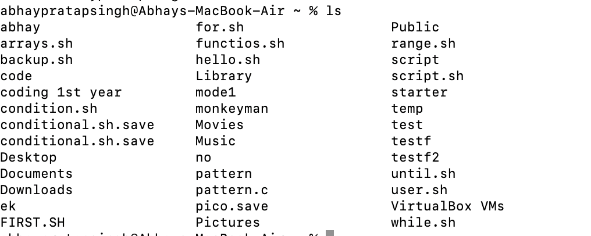
* `ls -l` → Detailed list (permissions, size, date)
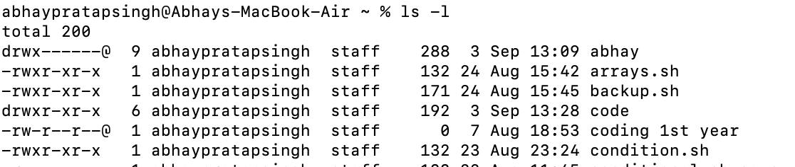
* `ls -a` → Shows hidden files (those starting with `.`)
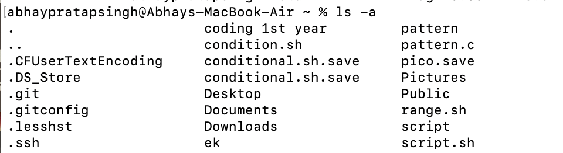
* `ls -la` → Combined
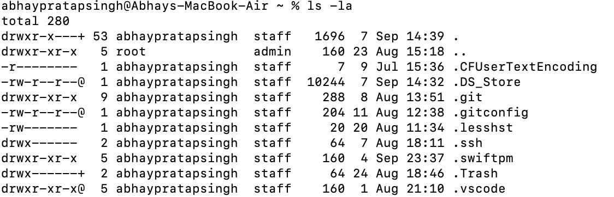

---

### `cd` – Change Directory

Moves into a directory.

```bash
cd folder_name
```


Examples:

```bash
cd Documents        # Go to Documents
cd ..               # Go up one level
cd /                # Go to root
cd ~                # Go to home directory

```


---

## ✅ 2. **File and Directory Management**

### `mkdir` – Make Directory

Creates a new folder.

```bash
mkdir new_folder
```

---

### `touch` – Create File

Creates an empty file.

```bash
touch file.txt
```
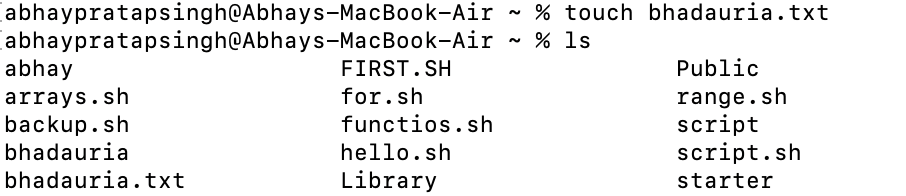
---

### `cp` – Copy Files or Directories

```bash
cp source.txt destination.txt
```
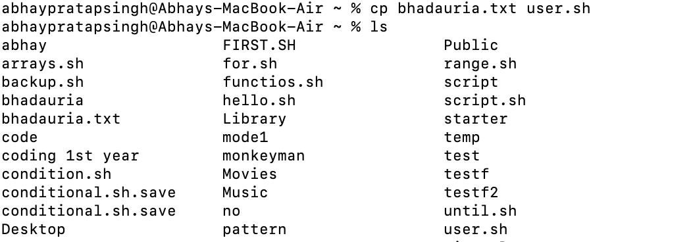

* Copy folder:

```bash
cp -r folder1 folder2
```
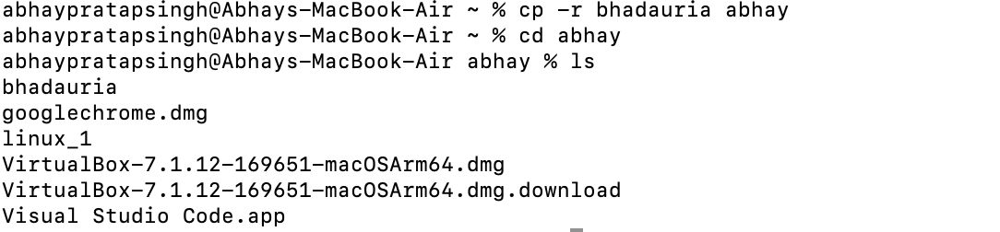
---

### `mv` – Move or Rename Files

```bash
mv oldname.txt newname.txt
```

```bash
mv file.txt ~/Documents/     # Move file
```
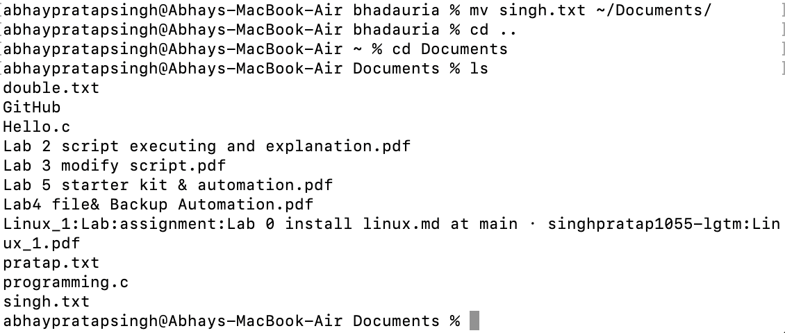
---

### `rm` – Remove Files

```bash
rm file.txt          # Delete file


rm -r folder_name    # Delete folder (recursively)
```
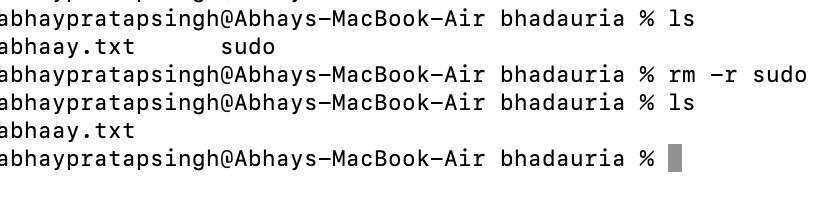

⚠️ **Be careful!** There is no undo.

---

## ✅ 3. **File Viewing & Editing**

### `cat` – View File Contents

Displays content in terminal.

```bash
cat file.txt
```
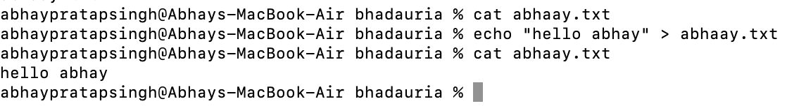
---

### `nano` – Edit Files in Terminal

A basic terminal-based text editor.

```bash
nano file.txt
```

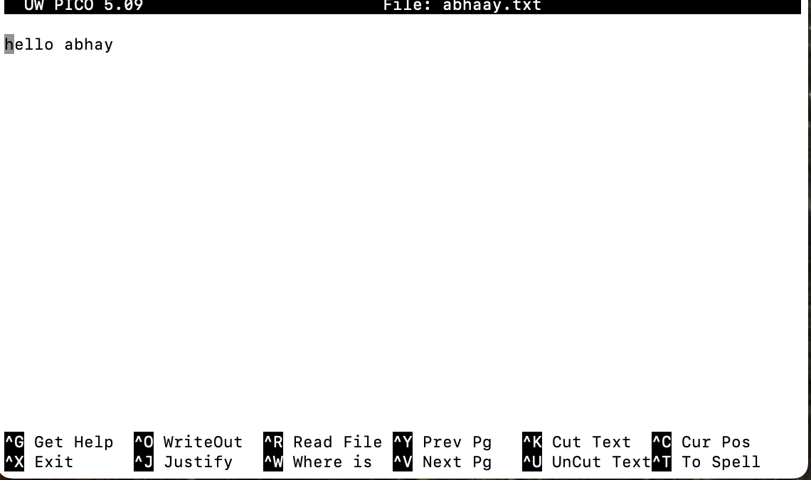

* Use arrows to move
* `CTRL + O` to save
* `CTRL + X` to exit

---

### `clear` – Clears the Terminal

```bash
clear
```


Shortcut: `CTRL + L`

---

## ✅ 4. **System Commands**

### `echo` – Print Text

Useful for debugging or scripting.

```bash
echo "Hello, World!"
```


---

### `whoami` – Show Current User

```bash
whoami
```


---

### `man` – Manual for Any Command

```bash
man ls
```


Use `q` to quit the manual.

---


## ✅ 5. **Searching and Finding**

### `find` – Locate Files

```bash
find . -name "*.txt"
```

🔍 Finds all `.txt` files in current folder and subfolders.

---

### `grep` – Search Inside Files

```bash
grep "hello" file.txt
```

🔍 Searches for the word `hello` inside `file.txt`.

---

## ✅ 6. **Helpful Shortcuts**

| Shortcut   | Action                      |
| ---------- | --------------------------- |
| `Tab`      | Auto-complete files/folders |
| `↑ / ↓`    | Browse command history      |
| `CTRL + C` | Stop a running command      |
| `CTRL + L` | Clear screen                |

---

## ✅ 7. **Bonus: Chaining Commands**

* **Run multiple commands**:

```bash
mkdir test && cd test && touch hello.txt
```


* **Run only if previous command succeeds**: `&&`
* **Run regardless of success**: `;`

---


# Sudo and Admin managment commands


## ✅ 1. **`sudo` – Run Commands as Administrator**

`sudo` (SuperUser DO) allows you to run commands with root privileges.

```bash
sudo command
```

Example:

```bash
sudo apt update      # Run package update as admin
sudo reboot          # Reboot system
```

You'll usually be prompted to enter your password.

---

## ✅ 2. **User Management (Linux/macOS only)**

### 👤 `adduser` – Create a New User

```bash
sudo adduser newusername
```

You’ll be prompted to set a password and user info.

### 🔑 `passwd` – Change User Password

```bash
sudo passwd newusername
```

---

### 👥 `usermod` – Modify User Account

Add a user to a group:

```bash
sudo usermod -aG groupname username
```

Example:

```bash
sudo usermod -aG sudo alice     # Give 'alice' sudo access
```

---

### ❌ `deluser` – Delete a User

```bash
sudo deluser username
```

To remove the user's home directory:

```bash
sudo deluser --remove-home username
```

---

## ✅ 3. **File Permissions with `chmod` and `chown`**

### 🔐 `chmod` – Change File Permissions

Basic syntax:

```bash
chmod [permissions] file
```

#### Common Usage:

```bash
chmod 755 script.sh     # Owner: read/write/execute; others: read/execute
chmod +x file.sh        # Add execute permission
chmod -x file.sh        # Remove execute permission
```

### 🔢 What Do Numbers Mean?

| Number | Permission             |
| ------ | ---------------------- |
| 7      | read + write + execute |
| 6      | read + write           |
| 5      | read + execute         |
| 4      | read only              |
| 0      | no permission          |

Example:

```bash
chmod 644 file.txt
# Owner: read/write, Group: read, Others: read
```

---

### 👑 `chown` – Change File Owner

```bash
sudo chown user:group file
```

Example:

```bash
sudo chown alice:alice myfile.txt
```

---

## ✅ 4. **Disk Usage & System Info**

### 💽 `df` – Disk Space Usage

```bash
df -h
```

Shows mounted partitions with human-readable sizes.

---

### 📁 `du` – Directory Size

```bash
du -sh folder_name
```

---

### 🖥️ `top` – Live System Processes

```bash
top
```

Press `q` to quit.

Alternative: `htop` (better UI, needs to be installed)

---

## ✅ 5. **Networking Commands**

### 🌐 `ping` – Check Network Connectivity

```bash
ping google.com
```

Press `CTRL + C` to stop.

---

### 📶 `ifconfig` or `ip a` – Show IP Address & Network Info

```bash
ip a
```

```bash
ifconfig   # May require sudo or installation
```

---

### 🔍 `netstat` – Show Active Network Connections

```bash
netstat -tuln
```

Or use:

```bash
ss -tuln   # Faster alternative
```

---

## ✅ 6. **Package Management**

### For **Ubuntu/Debian (APT)**:

```bash
sudo apt update            # Refresh package list
sudo apt upgrade           # Upgrade installed packages
sudo apt install git       # Install a package
sudo apt remove git        # Uninstall a package
```

---

### For **macOS (Homebrew)**:

```bash
brew install git
```

---

## ✅ 7. **Process Management**

### 🔎 `ps` – Show Running Processes

```bash
ps aux
```

### 🔫 `kill` – Kill a Process

```bash
kill <PID>
```

Example:

```bash
kill 12345
```

Force kill:

```bash
kill -9 12345
```

---

## ✅ 8. **Shutdown and Reboot**

```bash
sudo shutdown now        # Immediate shutdown
sudo shutdown -r now     # Immediate reboot
```


# **Linux**, **users** and **groups** access management commands

## ✅ **1. Users in Linux**

A **user** in Linux represents an individual account, and each user can be assigned specific **permissions** to access files, execute programs, and interact with the system.

### Types of Users:

1. **Root User (Superuser)**

   * **Username**: `root`
   * **ID**: `UID 0` (The user ID for `root` is always 0)
   * **Role**: The most powerful user on the system. Has **full control** over the system, can modify anything, and execute any command.
   * **Privileges**: Can access, modify, and delete any file, even system files.

2. **Normal User**

   * Regular users who have access only to their files and certain system files.
   * **ID**: Assigned a unique `UID` starting from `1000` (typically, depending on your Linux distribution).
   * **Role**: Can execute commands, edit files, and access files in their home directories.
   * **Privileges**: They are restricted by permissions (e.g., they can’t access or modify files owned by the root user unless granted explicit permission).

3. **System User**

   * **UID**: Typically lower than `1000`.
   * **Role**: Used by system services and processes. These users don't log in directly, but are associated with daemons or background services like **www-data** (for web servers) or **mysql** (for the MySQL service).
   * **Privileges**: Limited access for service operation purposes.

---

## ✅ **2. Groups in Linux**

A **group** in Linux is a collection of users. By organizing users into groups, you can control access to files or directories that are shared among users of the same group. This makes managing permissions much easier.

### Types of Groups:

1. **Primary Group**
   Every user is assigned a **primary group** when created. This is the group that the user belongs to by default.

   * **Example**: If you create a user `alice`, the primary group might be `alice` as well, which is created automatically during user creation.

2. **Secondary Groups**
   A user can belong to **multiple groups**. Secondary groups provide a way to grant additional access to specific resources.

   * For example, the user `alice` might also be part of the group `developers`, giving her additional access to certain files.

3. **System Group**
   Similar to system users, system groups are used for special purposes (e.g., service groups like `www-data`, `mysql`, etc.).

   * These groups often don’t have interactive logins and are associated with system processes.

---

## ✅ **3. Creating and Managing Users & Groups**

### **Create a New User**

Use the `adduser` command to create a new user and assign it a home directory.

```bash
sudo adduser newuser
```

This will create a user named **`newuser`** and ask you to set a password and other details. The **primary group** for the user will also be created with the same name.

### **Create a New Group**

Use the `groupadd` command to create a new group.

```bash
sudo groupadd newgroup
```

This creates a new group **`newgroup`** on the system.

---

### **Assign a User to a Group**

To add a user to a group, you can use the `usermod` command.

```bash
sudo usermod -aG groupname username
```

Example:

```bash
sudo usermod -aG developers alice
```

This command adds **`alice`** to the **`developers`** group.

### **Change User's Primary Group**

To change a user's **primary group**, use the `usermod` command with the `-g` option.

```bash
sudo usermod -g newgroup username
```

Example:

```bash
sudo usermod -g admin bob
```

This will change **`bob`'s** primary group to **`admin`**.

---

### **List All Users**

To list all users in the system:

```bash
cat /etc/passwd
```

This will show all user accounts on the system, including their home directories, login shells, and more.

### **List All Groups**

To list all groups:

```bash
cat /etc/group
```

This will display a list of groups on the system, including their associated users.

---

## ✅ **4. File Permissions and Groups**

Linux permissions are often set based on **users** and **groups**. These permissions control who can **read, write, or execute** a file.

### Example:

```bash
-rwxr-xr--
```

* The first character indicates whether it's a **file** (`-`) or a **directory** (`d`).
* The next three characters represent the **owner**'s permissions.
* The next three characters represent the **group**'s permissions.
* The last three characters represent **other users**' permissions.

### Changing Group Permissions

To modify the group associated with a file or directory:

```bash
sudo chown :groupname file
```

Example:

```bash
sudo chown :developers file.txt
```

This changes the group associated with `file.txt` to the **`developers`** group.

---

## ✅ **5. Default Groups and User IDs (UIDs)**

* **UID 0**: Root user (`root`).
* **UID 1000 and higher**: Regular users.
* **GID 0**: Root group (the group associated with the `root` user).
* **GID > 1000**: Normal groups created by users.

### Viewing a User’s UID and GID

```bash
id username
```

Example:

```bash
id alice
```

This will show the **UID**, **GID**, and the groups that `alice` is part of.

---

## ✅ **6. Special Groups in Linux**

* **`sudo` or `wheel` group**: Members of this group have the ability to run commands as the root user using `sudo`.
* **`www-data`**: The web server (e.g., Apache) often runs under this user and group.
* **`staff`**: Common on macOS, often used to grant additional permissions to users.
* **`sudo` or `admin`**: Users in these groups have administrative privileges.

---

## ✅ **7. Deleting Users and Groups**

### **Delete a User**

To delete a user and their home directory:

```bash
sudo deluser --remove-home username
```

This deletes the user and removes their home directory.

### **Delete a Group**

To delete a group:

```bash
sudo delgroup groupname
```

---

## **Summary**

* **Users** are individual accounts in Linux.

  * Root (UID 0) is the superuser with unrestricted access.
  * Regular users have limited permissions.
  * System users are used for specific processes or services.
* **Groups** are collections of users. They allow for more efficient permission management.

  * Primary groups are assigned to each user by default.
  * Secondary groups give a user access to multiple shared resources.
* **Permissions** for files and directories are assigned based on users and groups, and can be adjusted with commands like `chmod` and `chown`.


# File Permissions with `chmod` and `chown`

---

## 🔹 1. Understanding File Permissions in Linux

Each file/directory in Linux has:

* **Owner** → The user who created the file.
* **Group** → A group of users who may share access.
* **Others** → Everyone else.

### Permission Types

* **r** → Read (4 in numeric)
* **w** → Write (2 in numeric)
* **x** → Execute (1 in numeric)

### Permission Layout

Example from `ls -l`:

```
-rwxr-xr--
```
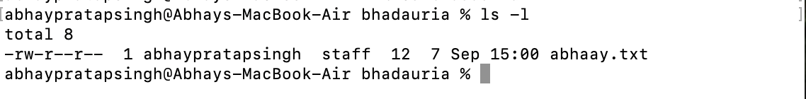

Breakdown:

* `-` → Regular file (`d` = directory, `l` = symlink, etc.)
* `rwx` → Owner has read, write, execute
* `r-x` → Group has read, execute
* `r--` → Others have read only

---

## 🔹 2. `chmod` – Change File Permissions

### Syntax

```bash
chmod [options] mode filename
```

Modes can be set in **numeric (octal)** or **symbolic** form.

---

### (A) Numeric (Octal) Method

Each permission is represented as a number:

* Read = 4
* Write = 2
* Execute = 1

Add them up:

* `7 = rwx`
* `6 = rw-`
* `5 = r-x`
* `4 = r--`
* `0 = ---`

#### Example:

```bash
chmod 755 script.sh
```
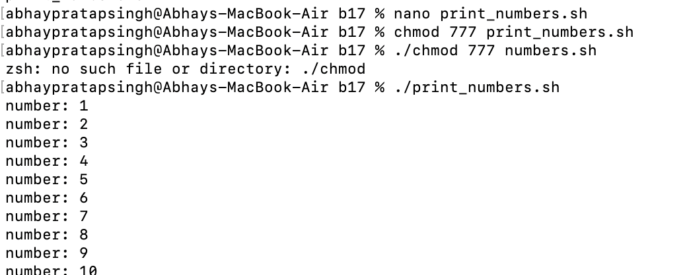
Meaning:

* Owner: 7 → `rwx`
* Group: 5 → `r-x`
* Others: 5 → `r-x`

---

### (B) Symbolic Method

Use `u` (user/owner), `g` (group), `o` (others), `a` (all).
Operators:

* `+` → Add permission
* `-` → Remove permission
* `=` → Assign exact permission

#### Examples:

```bash
chmod u+x script.sh     # Add execute for owner
chmod g-w notes.txt     # Remove write from group
chmod o=r file.txt      # Set others to read only
chmod a+r report.txt    # Everyone gets read access
```

---

### (C) Recursive Changes

```bash
chmod -R 755 /mydir
```
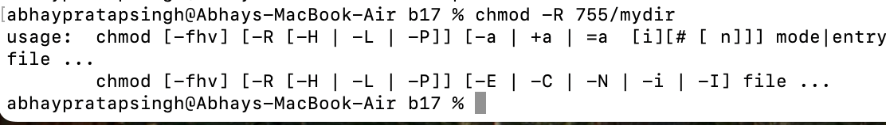

* `-R` → applies changes recursively to all files/subdirectories.

---

## 🔹 3. `chown` – Change File Ownership

### Syntax

```bash
chown [options] new_owner:new_group filename
```

### Examples:

```bash
chown abhay file.txt           # Change owner to user 'abhay'
chown abhay:pratap file.txt       # Change owner to 'abhay' and group to 'pratap'
chown :pratap file.txt            # Change only group to 'pratap'
chown -R abhay:pratap /project    # Recursive ownership change
```

---

## 🔹 4. Putting It All Together

### Example Scenario

```bash
touch project.sh
ls -l project.sh
```


Output:

```
-rw-r--r-- 1 abhaypratapsingh 0 7 Sep 15:49  project.sh
```

Now:

```bash
chmod 700 project.sh       # Only owner has rwx
chmod u+x,g-w project.sh   # Add execute for user, remove write for group
chown root:admin project.sh # Change owner to root and group to admin
```

---

## 🔹 5. Quick Reference Table

| Numeric | Permission | Meaning      |
| ------- | ---------- | ------------ |
| 0       | ---        | No access    |
| 1       | --x        | Execute only |
| 2       | -w-        | Write only   |
| 3       | -wx        | Write + Exec |
| 4       | r--        | Read only    |
| 5       | r-x        | Read + Exec  |
| 6       | rw-        | Read + Write |
| 7       | rwx        | Full access  |

---

✅ **Key Tip**: Use **numeric for quick settings** (e.g., 755, 644) and **symbolic for fine adjustments** (`u+x`, `g-w`).

---