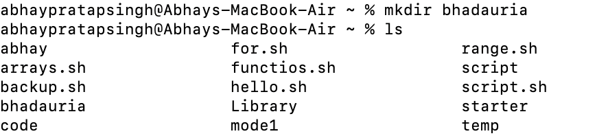
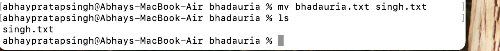
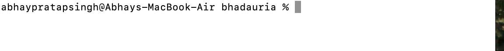
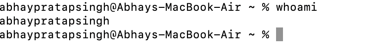
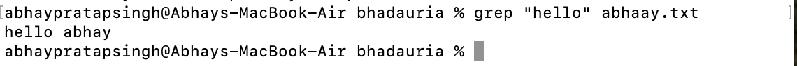
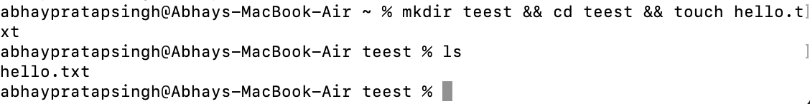

Here's a **detailed tutorial on basic terminal commands** that work on **Linux, macOS, and Git Bash (Windows)**. These commands are essential for navigating and managing files from the terminal, especially for coding and version control (e.g., Git, VS Code, etc.).

---

## ✅ 1. **Navigation Commands**

### `pwd` – Print Working Directory

Shows the current location in the filesystem.

```bash
pwd
```

📌 Output example:

```
/Users/abhaypratapsingh/Documents/GitHub/Linux_1
```

---

### `ls` – List Directory Contents

Lists files and folders in the current directory.

```bash
ls
```

* `ls -l` → Detailed list (permissions, size, date)

* `ls -a` → Shows hidden files (those starting with `.`)

* `ls -la` → Combined


---

### `cd` – Change Directory

Moves into a directory.

```bash
cd folder_name
```


Examples:

```bash
cd Documents        # Go to Documents
cd ..               # Go up one level
cd /                # Go to root
cd ~                # Go to home directory

```


---

## ✅ 2. **File and Directory Management**

### `mkdir` – Make Directory

Creates a new folder.

```bash
mkdir new_folder
```

---

### `touch` – Create File

Creates an empty file.

```bash
touch file.txt
```

---

### `cp` – Copy Files or Directories

```bash
cp source.txt destination.txt
```


* Copy folder:

```bash
cp -r folder1 folder2
```

---

### `mv` – Move or Rename Files

```bash
mv oldname.txt newname.txt
```

```bash
mv file.txt ~/Documents/     # Move file
```

---

### `rm` – Remove Files

```bash
rm file.txt          # Delete file


rm -r folder_name    # Delete folder (recursively)
```


⚠️ **Be careful!** There is no undo.

---

## ✅ 3. **File Viewing & Editing**

### `cat` – View File Contents

Displays content in terminal.

```bash
cat file.txt
```

---

### `nano` – Edit Files in Terminal

A basic terminal-based text editor.

```bash
nano file.txt
```


* Use arrows to move
* `CTRL + O` to save
* `CTRL + X` to exit

---

### `clear` – Clears the Terminal

```bash
clear
```


Shortcut: `CTRL + L`

---

## ✅ 4. **System Commands**

### `echo` – Print Text

Useful for debugging or scripting.

```bash
echo "Hello, World!"
```


---

### `whoami` – Show Current User

```bash
whoami
```


---

### `man` – Manual for Any Command

```bash
man ls
```


Use `q` to quit the manual.

---


## ✅ 5. **Searching and Finding**

### `find` – Locate Files

```bash
find . -name "*.txt"
```

🔍 Finds all `.txt` files in current folder and subfolders.

---

### `grep` – Search Inside Files

```bash
grep "hello" file.txt
```

🔍 Searches for the word `hello` inside `file.txt`.

---

## ✅ 6. **Helpful Shortcuts**

| Shortcut   | Action                      |
| ---------- | --------------------------- |
| `Tab`      | Auto-complete files/folders |
| `↑ / ↓`    | Browse command history      |
| `CTRL + C` | Stop a running command      |
| `CTRL + L` | Clear screen                |

---

## ✅ 7. **Bonus: Chaining Commands**

* **Run multiple commands**:

```bash
mkdir test && cd test && touch hello.txt
```


* **Run only if previous command succeeds**: `&&`
* **Run regardless of success**: `;`

---


