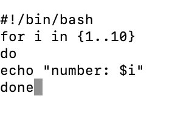

# LAB2.md
## 2.Script: print _numbers.sh
### Purpose
-This script prints numbers from 1 to 5 using a loop.
### code 

### line-by-line explanation
1.#!/bin/bash-shebang, tells the system to run the script with the bash shell.

2.# script to print numbers from 1 to 5 - A comment describing the script.

3.for i in {1..5} - Loop from 1 through 5,assigning each value to variable i.

4.do - Marks the beginning of commands inside the loop.

5.echo "number: $i" - Prints the current number with a label.

6.done - marks the end of the loop.

### Example Run

## 3.Script:array_access.sh

### Purpose
-This script loops through an array of names and prints each one.
### code 

### line-by-line explanation
1.#!/bin/bash → Uses Bash shell to run the script.

2.# Script to demonstrate array and loop → Comment.

3.names=("abhay" "pratap" "singh") → Declares an array with three elements.

4.for name in "${names[@]}" → Loops through all elements of the array, assigning each one to name.

5.do → Start of loop body.

6.echo "Hello, $name!" → Prints a greeting for each array element.

7.done → End of loop"

### Example Run

