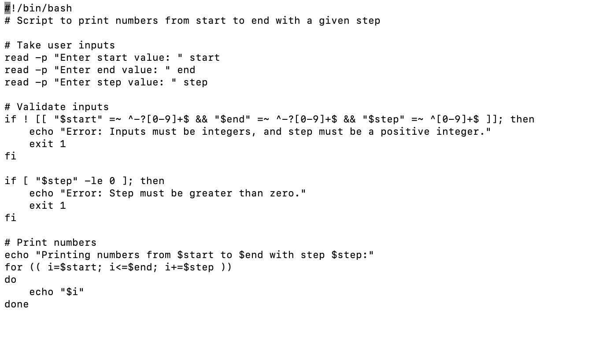
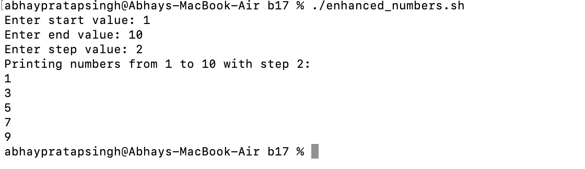
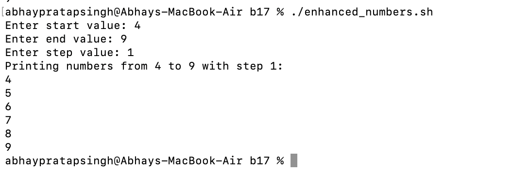

# ✅ Script: enhanced_numbers.sh

### Make it executable:

### Example Run

## Modified Script (⁠ enhanced_numbers.sh ⁠)
### ⁠Purpose: 

.Print numbers with user-defined start, end, and step.

•  ⁠Input: User enters values at runtime.
•⁠  ⁠Validation:
•⁠  ⁠Step must be a positive integer.
•⁠  ⁠Inputs must be integers.
•⁠  ⁠Output: Prints sequence based on user choices.

### Example Runs

Example1

Example2

ques1- "Difference between $1, $@, and $# in bash?"

🔹 1. $1
Refers to the first positional argument passed to the script or function.

Similarly, $2 is the second, $3 is the third, and so on.

Example:

#!/bin/bash
echo "First argument: $1"
Run:

$ ./script.sh apple banana cherry
First argument: apple

🔹 2. $@
Represents all the positional arguments as a list.

Each argument is treated as a separate word (preserves spaces if quoted).

Example:

#!/bin/bash
echo "All arguments: $@"
Run:

$ ./script.sh apple banana cherry

All arguments: apple banana cherry

If arguments have spaces:

$ ./script.sh "red apple" banana

All arguments: red apple banana

🔹 3. $#
Represents the number of positional arguments passed to the script.

Example:

#!/bin/bash
echo "Number of arguments: $#"
Run:

$ ./script.sh apple banana cherry
Numbers of arguments: 3

ques2-"What does exit 1 mean in a script?"

".

🔹 exit 1 Meaning
exit 1 ends the script and returns status code 1.

By convention:

exit 0 → Success (everything worked as expected).

exit 1 (or any non-zero number) → Error / Failure (something went wrong)."

