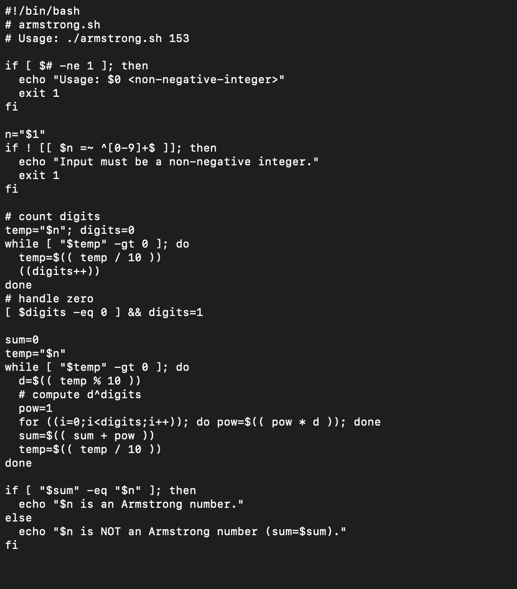
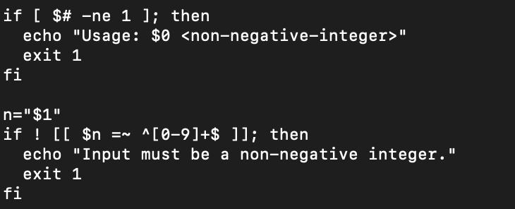
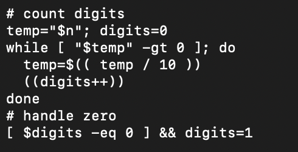
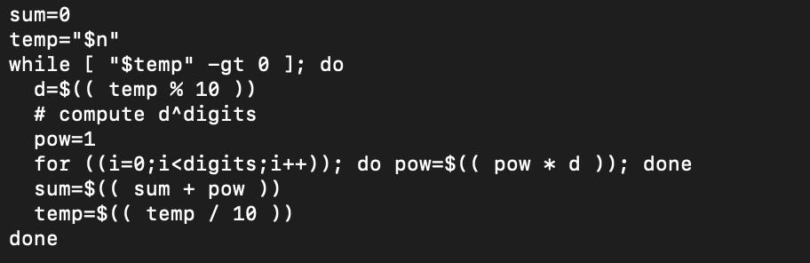
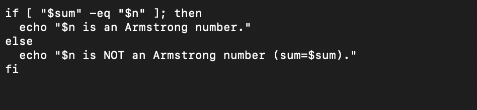
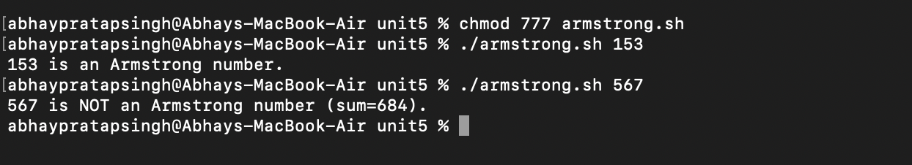

### ----------CHECK THE NUMBER IS ARMSTRONG-----------

## EXPLANATION........

# 📌 Script Explanation (Step by Step)
#!/bin/bash
# armstrong.sh
# Usage: ./armstrong.sh 153
Shebang (#!/bin/bash) → tells Linux to run the script with Bash.

Comments explain usage: ./armstrong.sh number.

1.⁠ ⁠Input validation:

.Checks if exactly one argument is passed.

.Ensures the input is a non-negative integer (using regex ^[0-9]+$).

2.⁠ ⁠Count the number of digits

Example: For 153 → 3 digits.

3.⁠ ⁠Compute Armstrong sum

Extracts each digit.

Raises it to the power of number of digits.

Adds to running total sum.

4.⁠ ⁠Compare sum with original number

If sum equals original → Armstrong number.

Otherwise → Not Armstrong.

✅ Example Run

