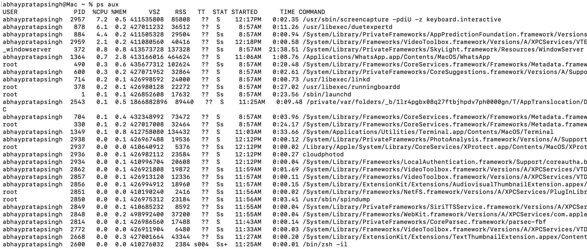
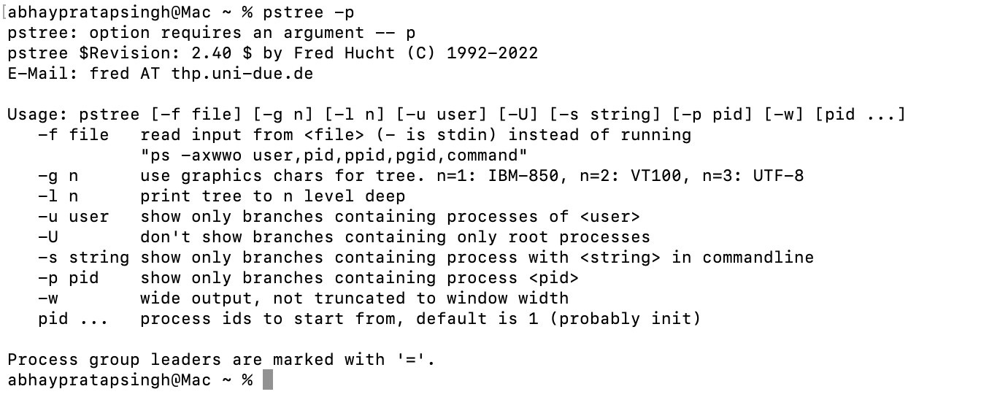
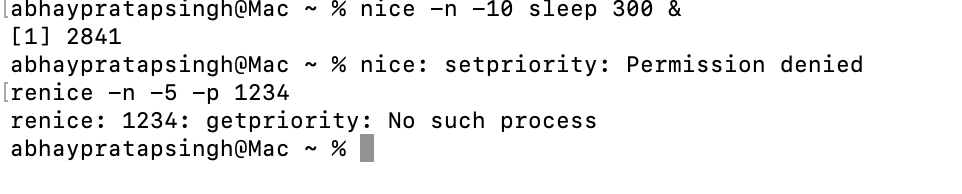
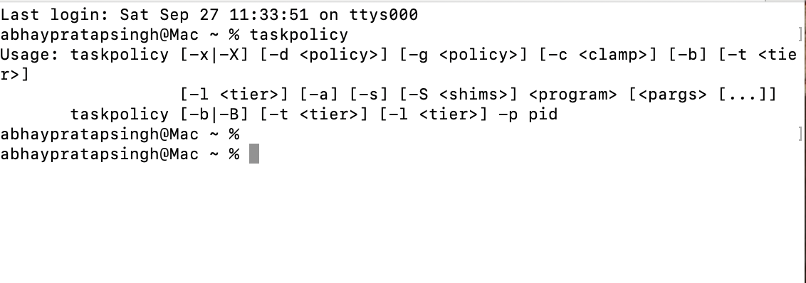
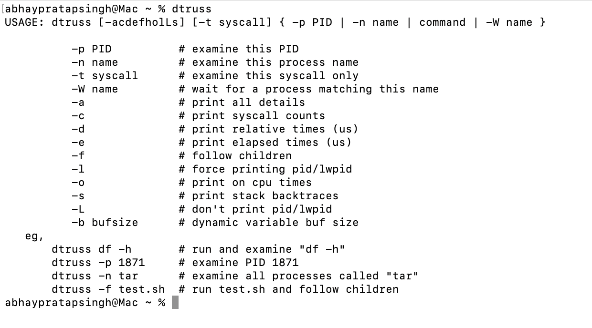
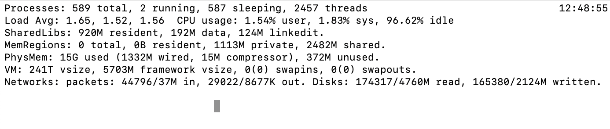

# 🌲 1. Show All Processes
### Command:
ps aux

### output

👉 Same as Linux, works fine.

## 🌳 2. Process Tree
### Command:

pstree -p

### output

### 👉 Not installed by default. Install via:

brew install pstree

## 📊 3. Real-Time Monitoring
### Command:

top

Differences from Linux:

%CPU shows per-thread, so may exceed 100%.

Interactive keys differ (press q to quit, but no M/P sorting by default).

## ⚡ 4. Adjust Process Priority
Start with nice value:
### command
nice -n 10 sleep 300 &

### output

### Change priority:

renice -n -5 -p 3050

👉 Same as Linux.

## 🔧 5. CPU Affinity (Bind to Core)
macOS does not support taskset.
Alternative: use cpulimit (via Homebrew) or Xcode’s sched_setaffinity() APIs — but no built-in CLI equivalent.

## 📂 6. I/O Scheduling Priority
ionice is Linux-only, macOS has no direct equivalent.

Closest: use renice for CPU-bound I/O, but disk I/O scheduling can’t be tuned via CLI.

### Alternative command for macOS.
### command.
taskpolicy

## 📑 7. File Descriptors Used by Process
Command:

lsof -p 3050 | head -5

👉 Works same as Linux.

## 🐛 8. Trace System Calls
### Command:

dtruss -p 3050

### output

Example:

sudo dtruss -p 3050

👉 dtruss is the macOS equivalent of strace. (Needs SIP disabled for some cases or run as root).

## 📡 9. Find Process Using a Port
### Command:

lsof -i :8080

👉 fuser is not available by default, use lsof.

## 📊 10. Per-Process Statistics
pidstat is Linux-only. On macOS use:
### command
top -pid 3050

or

ps -p 3050 -o %cpu,%mem,etime,comm

## 🔐 11. Control Groups (cgroups)
❌ Not available on macOS.
👉 Instead, you can use launchd limits (launchctl limit) or third-party tools like Docker (which uses Linux cgroups internally).

 